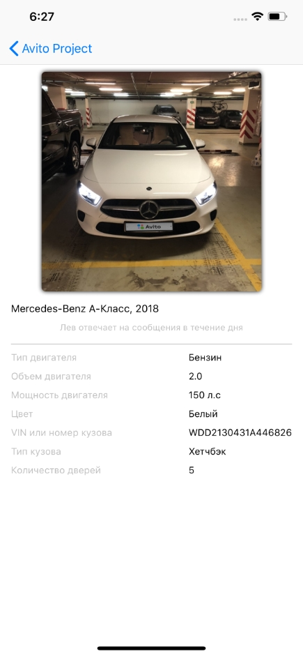

# Решение задачи для стажера на платформу iOS в Avito

Приложение является расширенным решением задачи и содержит в себе UI для демонастрационного отображения итоговых данных файла Structure_with_values.json
## Возможности приложения
### Главный экран
Экран представляет собой кастомный UICollectionView и содержит следующие параметры автомобиля:
 - марка;
 - модель;
 - графический элемент избранного объявления;
 - фотография.
 
 
 

 
 Фотография была взята из интернета и используется, исключительно, в демонстрационных целях.
 
 Элемент избранного объявления сделан с помощью кастомного UIView класса и имеет возможность настраиваться через Storyboard.
 
### Экран характеристик автомобиля
При нажатии на фотографию, отображается экран со следующими характеристиками автомобиля:
 - тип двигателя;
 - объем двигателя;
 - мощность двигателя;
 - цвет;
 - VIN или номер кузова;
 - тип кузова;
 - количество дверей.
 
  
 

### Экран пути к итоговому файлу JSON
Для того, чтобы увидеть путь к итоговому файлу JSON был создан отдельный экран.

  
 

 
